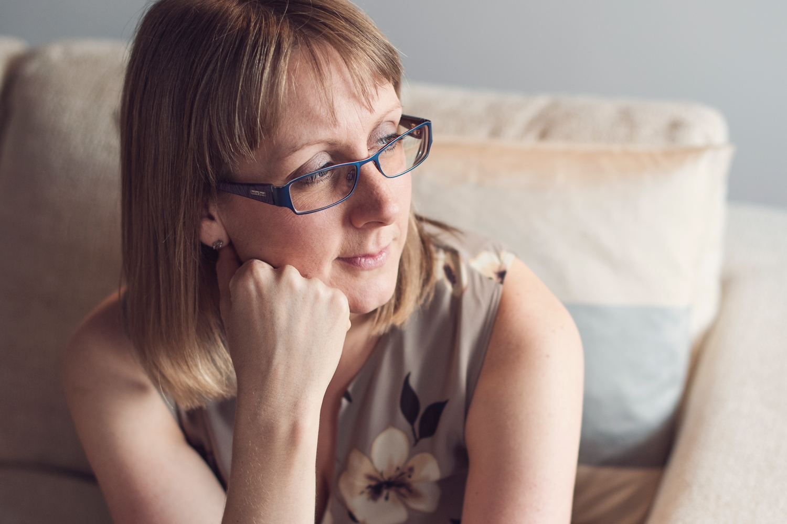

Clare Littlemore is a young adult dystopian and sci-fi author who thrives on fictionally destroying the world with a cup of tea by her side. The tea will often be cold, because her characters have a way of grabbing hold of her and not letting go until the final page of their story is finished. They regularly have the same effect on her readers.

Clare lives in the North West of England with her husband and two children. She has a slight obsession with a certain boy wizard, and is never far from some kind of magical memorabilia. (She’s particularly partial to a cup of tea drunk from a HP-themed mug.) She loves to spend time with her family, and is mid-way through indoctrinating... **oops** make that passing on her various book-obsessions to her children.

Clare is an avid reader as well as a writer, and loves nothing better than to read great stories aloud. This passion accidentally led to a career as a teacher of high school English, which she sometimes regrets now she knows there is more to it than engaging students with a range of dramatic voices! But she firmly feels that no one is ever too old to listen to a story.

Some of her favourite books include the entire Harry Potter series, The Hunger Games, The Maze Runner, The Handmaid’s Tale and The Running Man. In both other people’s books and her own, she enjoys imagining how the world might look in a few decades and considering how ordinary characters might deal with the extraordinary situations the future throws at them.

**If you devour fast-paced, addictive stories with compelling characters who inhabit intriguing futures, you’ll love The Flow Series.**

[Sign up for Clare’s fortnightly newsletter](/newsletter?signup=website-about) and make sure you’re the first to hear about her next book!
