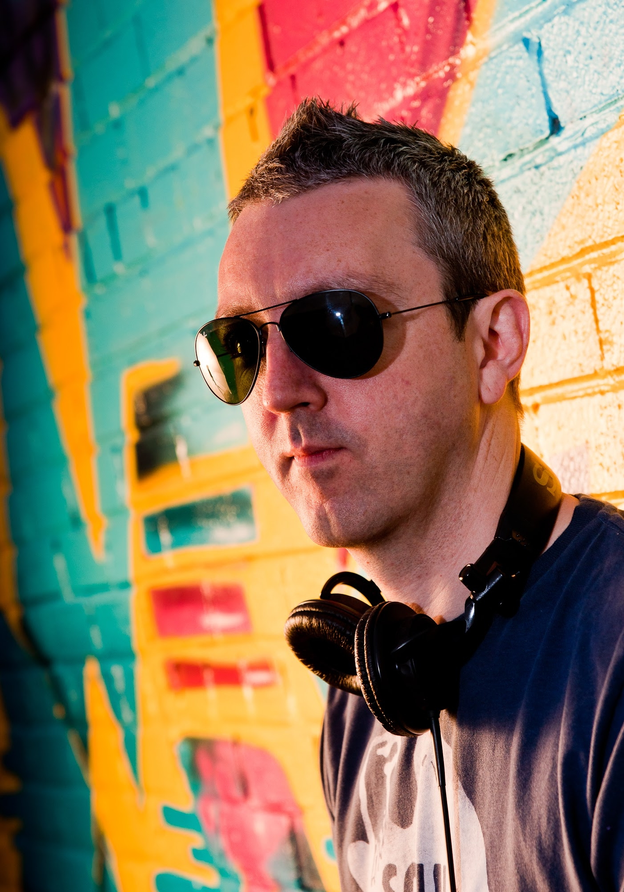

DJ Cruze is the alter ego of Marc Littlemore and he was born in a small town called Frodsham in Cheshire, England. He now resides in the sunny suburbs of Cheshire with his family.

## Humble beginnings

His love of electronic music started at an early age when he was introduced to the "Streetsounds Electro" compilations in the mid 80s. His introduction to electro and hip-hop forged his love for both funky and electronic music. Listening to Radio 1's Jeff Young, the predecessor to Pete Tong, on Friday evenings encouraged him to create push-button cassette mixes and started his vinyl buying habit. Trying to embrace the early hip-hop culture he realised that his rapping skills were terrible and his graffiti equally as bad, so he turned to the only thing left to do; DJ. On a belt-driven pair of Soundlab turntables and a Radioshack mixer he started to learn to mix and scratch. Surprisingly he became quite good and his mix-tapes got passed around the schoolyard.

## Manchester is in the house

A move to Manchester in 1990 to study at the university gave Marc a new found freedom to party. Manchester's thriving club scene allowed him to spend all of his money on vinyl and parties. He DJ'ed at various student bars and clubs in the city and these parties helped him to learn his crowd-pleasing skills. In 1992 a chance meeting of mutual friends introduced Marc to his long-term DJ'ing partner Mark Wyss aka DJ Vuish. As Wyss was studying in Mannheim, it proved the perfect opportunity for DJ Cruze mix-tapes to enter the Germany and for Mannheim's clubbers to be introduced to **"Manchester House"** a fine blend of early-90s funky UK and US house.

## And so to Germany

Germany loved the sound and DJ Cruze was invited to perform at the Milk Club in Mannheim, the XS Club in Frankfurt and the Om Club in Heilbronn in 1993 and 1994. From these early German DJ gigs, the partnership of Cruze and Vuish was born and from 1994, it began a 5 year residency at the legendary Vibration Club in Forst. They both continued to DJ in the UK too and held residencies and guest spots in some of Manchester's finest venues including The Haçienda, DNA, 2Kinky and Home.

## The future

Although DJ Vuish decided to take a break from DJ'ing in the early 2000s, DJ Cruze continued to play a funky mix of house music, electro and breakbeats and anything else that will rock a party! On top of the funky house music, he layers his turntable skills showing off his scratching and beat juggling magic. He is also busy in the studio trying to finally finish off the tracks that he has had in his head for many years!

## Musical Style

In the words of James Brown - "...it's got to be funky...". House music is the order of the day but any variations on a theme will be thrown onto the turntables. Funky house, electro, breakbeats, deep house. If it's good, it will be played! Added on top is some funky scratching and cut-ups which help to rock the dancefloor.

## Residencies and guest appearances

Some of the clubs where DJ Cruze has played. There are more but his memory isn't great!

### UK

- The Haçienda, Manchester
- DNA, Manchester
- 2Kinky, Manchester and Cheshire
- Home, Manchester
- Tall Trees, Yarm
- The Glasshouse, Leeds
- Mustard, Liverpool

### Germany

- XS Club, Frankfurt
- Milk Club, Mannheim
- Om Club, Heilbronn
- Vibration Club, Forst
- Jailhouse, Aachen
- Lemon, Heidelberg
- M1 Club, Stuttgart
- The Birdcage, Stuttgart
- Timewarp (various locations)
- Stockwerk, Karlsruhe
- The Loft Club, Ludwigshafen
- Madame Pompadour, Karlsruhe
